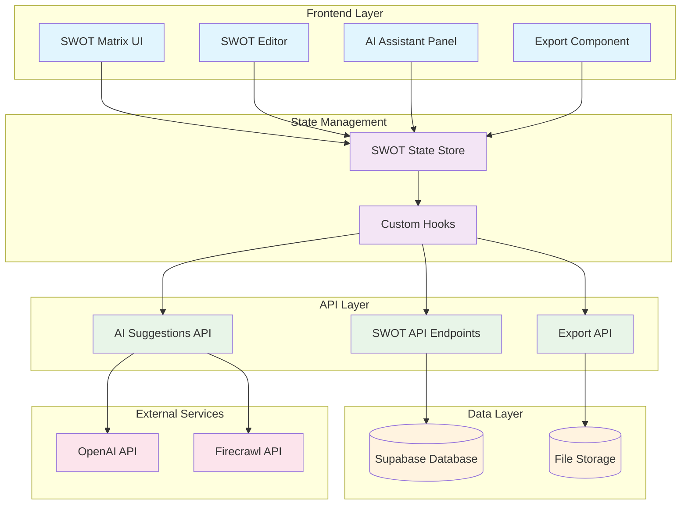
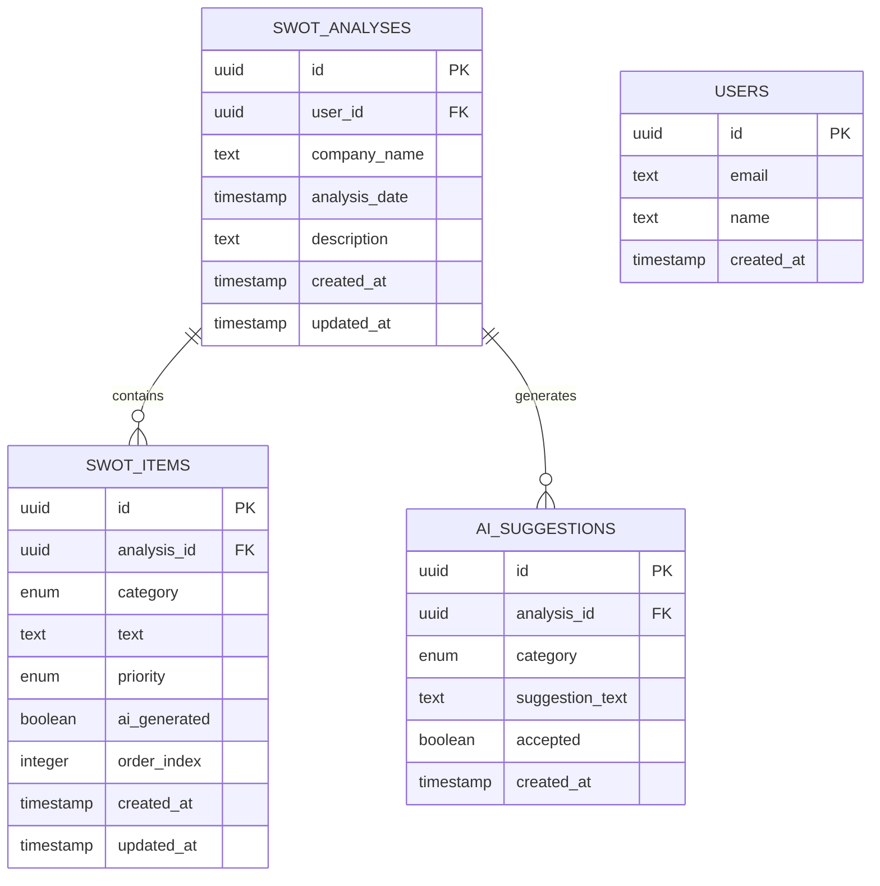
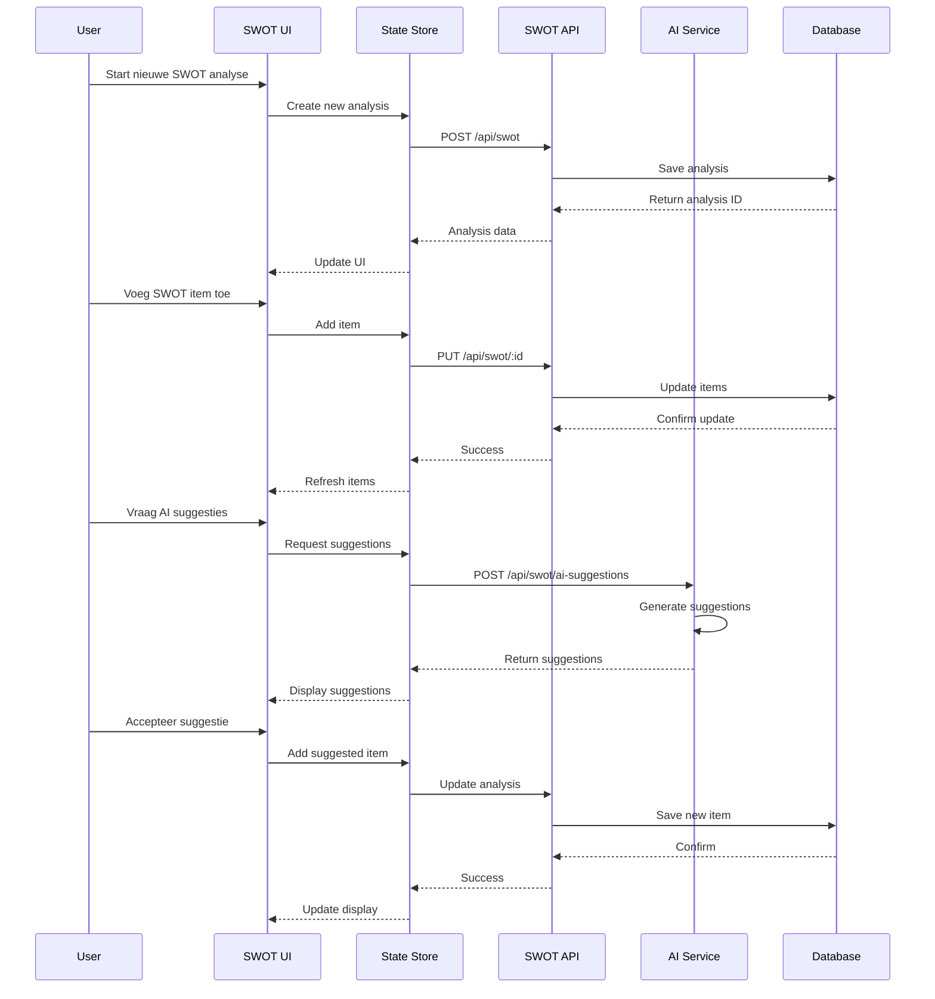
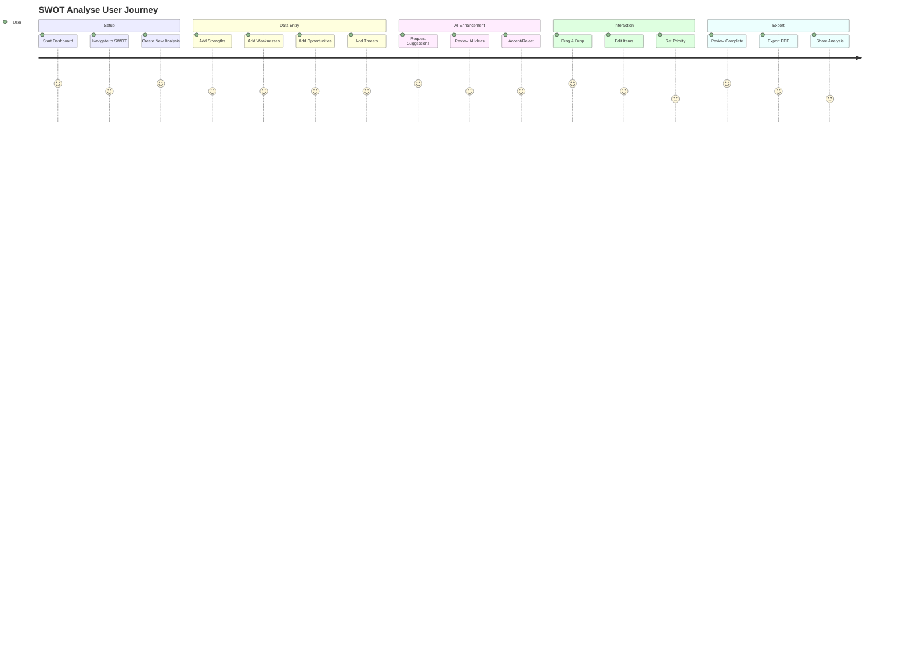
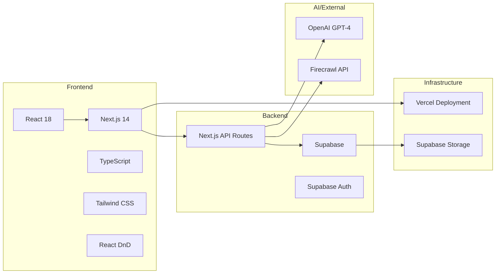
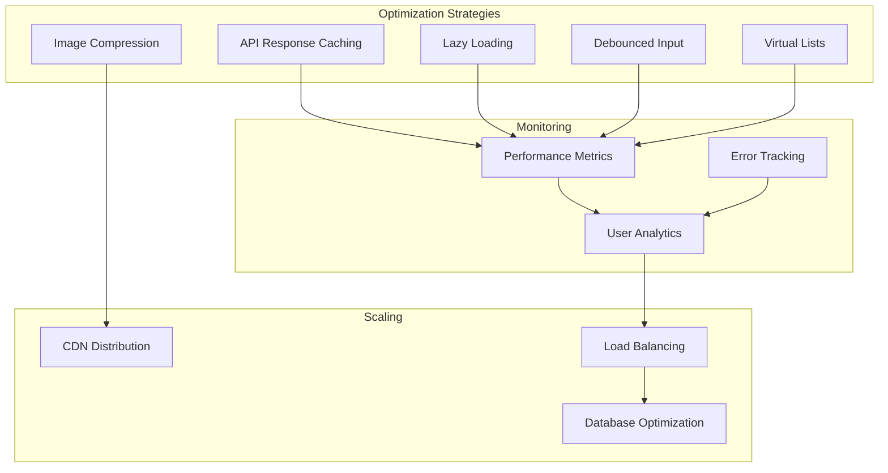
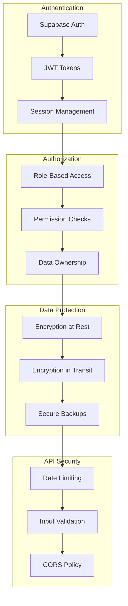

# SWOT Analyse - Architectuur & Implementatie Documentatie

## 📑 Inhoudsopgave

- [SWOT Analyse - Architectuur \& Implementatie Documentatie](#swot-analyse---architectuur--implementatie-documentatie)
  - [📑 Inhoudsopgave](#-inhoudsopgave)
  - [Overview](#overview)
  - [System Architectuur](#system-architectuur)
  - [Data Model](#data-model)
    - [Database Schema](#database-schema)
  - [Component Flow](#component-flow)
    - [Interaction Sequence](#interaction-sequence)
  - [User Journey](#user-journey)
    - [Gebruikerservaring Flow](#gebruikerservaring-flow)
  - [Technology Stack](#technology-stack)
    - [Tech Stack Overzicht](#tech-stack-overzicht)
  - [Performance Optimalisatie](#performance-optimalisatie)
    - [Strategieën voor Performance](#strategieën-voor-performance)
  - [Security Architectuur](#security-architectuur)
    - [Beveiligingslaag Structuur](#beveiligingslaag-structuur)
  - [Conclusie](#conclusie)

---

## Overview

Dit document beschrijft de complete architectuur voor de SWOT Analyse functionaliteit in het QuoteFast Dashboard. Het bevat systeemontwerp, data modellen, gebruikersflows en technische implementatie details.

---

## System Architectuur

De architectuur bestaat uit vier lagen: Frontend, State Management, API Layer, en Data Layer.

## Data Model

### Database Schema

## Component Flow

### Interaction Sequence

## User Journey

### Gebruikerservaring Flow

## Technology Stack

### Tech Stack Overzicht

## Performance Optimalisatie

### Strategieën voor Performance

## Security Architectuur

### Beveiligingslaag Structuur

---

## Conclusie

Dit document beschrijft de volledige architectuur voor de SWOT Analyse functionaliteit. De implementatie volgt best practices voor:

- ✅ Gescheiden lagen (separation of concerns)
- ✅ Schalbaar en onderhoudbaar design
- ✅ Beveiligde data toegang
- ✅ Optimale gebruikerservaring
- ✅ Performance geoptimaliseerde oplossingen

Voor implementatie details, zie: [SWOT_IMPLEMENTATION_PLAN.md](./SWOT_IMPLEMENTATION_PLAN.md)
